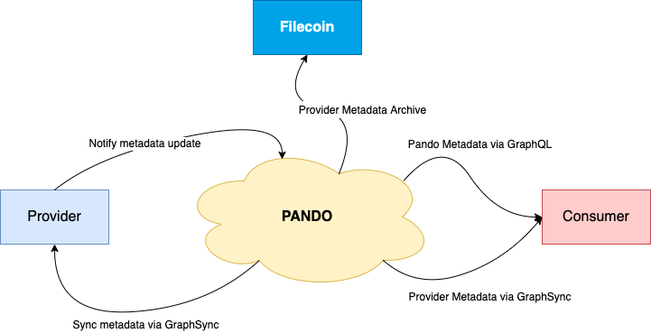

[](https://circleci.com/gh/kenlabs/pando/tree/main)
[](https://codecov.io/gh/kenlabs/pando)


- [Pando](#pando)
  - [Architecture](#architecture) 
  - [Getting Started](#getting-started)
    - [How Pando persistence providers data](#how-pando-persistence-providers-data)
    - [Build Pando server and client](#build-pando-server-and-client)
    - [Start a Pando server](#start-a-pando-server)
  - [Pando Server configuration](#pando-server-configuration)
  - [Access Pando APIs with client](#access-pando-apis-with-client)


# Pando
Ensuring access to notarized metadata


There are several mechanisms we directly foresee being used for incentivization feedback loops based around the metadata measurements of entities in the filecoin ecosystem. For instance, reports of miner behavior can be used by reputation systems ranking miners, which then are used by clients to select higher quality miners near them. This data doesn’t make sense to directly embed within the filecoin chain for a few reasons: It is produced by independent entities, so the data itself does not need to meet the same ‘consensus’ bar as what we would expect in a global chain, and likewise aspects of reputation and measurements may have aspects of subjectivity. It is also expected that there is diversity of data and that experimentation is a good thing.
However, there are nice properties of having this sort of metadata ecosystem more tightly linked to the chain that seem desirable to encourage, and this leads to the goals for the sidechain metadata service:

* Keep included metadata consistently available
* Provide light-weight, unbiased access to metadata
* Discourage historical revisionism.


## Architecture



## Getting Started

Pando using [go-legs](https://github.com/filecoin-project/go-legs) to synchronize IPLD DAG of data from providers.
We will develop an SDK for providers to integrate with Pando in a more efficient way in the future (maybe a week).
For now, providers have to initialize go-legs instance and publish your data to a topic which Pando subscribed.

Check [these examples](https://github.com/kenlabs/pando/tree/main/example) for more details.

### How Pando persistence providers data
ToDo

### Build Pando server and client
run `make`, that's all. Binaries will be built at `bin`.

### Start a Pando server
Initialize a config file first (defualt path is ~/.pando/config.yaml):
```bash
./pando-server init
```
Since Pando uses Estuary to upload the metadata of Provider to the Filecoin network, 
you need to set the API Key of Estuary in the configuration file:
```yaml
Backup:
  EstuaryGateway: https://api.estuary.tech
  ShuttleGateway: https://shuttle-4.estuary.tech
  ApiKey: "YOUR ESTUARY API KEY"
```

Now you can start a pando server:
```shell
./pando-server daemon
```

or start with custom listen address (in multiaddress format):
```shell
./pando-server daemon \
  --http-listen-addr /ip4/0.0.0.0/tcp/8080 \
  --graphql-listen-addr /ipv/0.0.0.0/tcp/8081
```

## Pando Server configuration
Pando support three types of config resource, and it will look up config value in this order:
- cli flag
- environment variable
- config file (yaml file)

ConfigFile (string), specify config file name(only name, not path, its parent path is PandoRoot):
- -f, --config-file
- PD_CONFIGFILE
- /

PandoRoot (string), specify pando root directory for config and data persistence:
- -r, --pando-root
- PD_PANDOROOT
- PandoRoot

PandoDisableSpeedTest (bool), disable internet speed test when init config:
- -p, --disable-speedtest
- PD_DISABLESPEEDTEST
- DisableSpeedTest

LogLevel (string, support DEBUG, INFO, WARN, ERROR, DPANIC, PANIC, FATAL), Pando core module log level
- --log-level
- PD_LOGLEVEL
- LogLevel

Identity.PeerID (string), peer ID of Pando
- /
- PD_IDENTITY_PEERID
- Identity.PeerID

Identity.PrivateKey (string), private key of Pando
- /
- PD_IDENTITY_PRIVATEKEY
- Identity.PrivateKey

ServerAddress.HttpAPIListenAddress (string, example: /ip4/127.0.0.1/tcp/9000), http api listen address in multi-address format
- --http-listen-addr
- PD_SERVERADDRESS_HTTPAPILISTENADDRESS
- ServerAddress.HttpAPIListenAddress

ServerAddress.GraphqlListenAddress (string), graphql api listen address in multi-address format
- --graphql-listen-addr
- PD_SERVERADDRESS_GRAPHQLISTENADDR
- ServerAddress.GraphqlListenAddress

ServerAddress.P2PAddress (string), p2p host listen address  in multi-address format
- --p2p-address
- PD_SERVERADDRESS_P2PADDRESS
- ServerAddress.P2PAddress

DataStore.Type (string), datastore type, support "levelds" only for now
- --datastore-type
- PD_DATASTORE_TYPE
- DataStore.Type

DataStore.Dir (sting), directory stores all the datastore data, its parent dir is PandoRoot
- --datastore-dir
- PD_DATASOTRE_DIR
- DataStore.Dir

Discovery.LotusGateway （string）, lotus gateway address
- --discovery-lotus-gateway
- PD_DISCOVERY_LOTUSGATEWAY
- Discovery.LotusGateway

Discovery.Policy.Allow (bool), allow all origin source host
- --discovery-policy-allow
- PD_DISCOVERY_POLICY_ALLOW
- Discovery.Policy.Allow

Discovery.Policy.Trust (bool), enable discovery white-list
- --discovery-policy-trust
- PD_DISCOVERY_POLICY_TRUST
- Discovery.Policy.Trust

Discovery.PollInterval (string, example: 24h0m0s), discovery poll interval
- /
- PD_DISCOVERY_POLLINTERVAL
- Discovery.PollInterval

Discovery.RediscoverWait (string), re-discovery wait time duration
- /
- PD_DISCOVERY_REDISCOVERYWAIT
- Discovery.RediscoverWait

Discovery.Timeout (stirng), discovery timeout
- /
- PD_DISCOVERY_TIMEOUT
- Discovery.Timeout

AccountLevel.Threshold (string slice), balance bound of provider, 
see details at [rate-limit doc](https://github.com/kenlabs/pando/blob/main/docs/ratelimit.md)
- --account-level
- PD_ACCOUNTLEVEL_THRESHOLD
- AccountLevel.Threshold

RateLimit.Bandwidth (float64), bandwidth of Pando service environment, this value will be filled when you run 
`./pando-server init`
- --ratelimit-bandwidth
- PD_RATELIMIT_BANDWIDTH
- RateLimit.Bandwidth

RateLimit.SingleDAGSize (float64), estimate size of single DAG structure metadata
- --ratelimit-single-dag-size
- PD_RATELIMIT_SINGLEDAGSIZE
- RateLimit.SingleDAGSize

Backup.EstuaryGateway (string), estuary gateway address
- --backup-estuary-gateway
- PD_BACKUP_ESTUARYGATEWAY
- Backup.EstuaryGateway

Backup.ShuttleGateway (string), estuary shuttle gateway address
- --backup-shuttle-dateway
- PD_BACKUP_SHUTTLEGATEWAY
- Backup.ShuttleGateway

Backup.APIKey (string), estuary api key
- --backup-apikey
- PD_BACKUP_APIKEY
- Backup.APIKey

## Access Pando APIs with client
See [Pando API document](https://pando-api-doc.kencloud.com) for more details.
Or check [Pando API Specification](https://github.com/kenlabs/pando/tree/main/pkg/api/swagger.yml)

### /pando/health 
Check if Pando is alive
```shell
./pando-client -a http://127.0.0.1:9000 pando info

{
 "code": 200,
 "message": "alive",
 "Data": null
}
```
### /pando/info
Show information of Pando server
```shell
./pando-client -a http://127.0.0.1:9000 pando info

{
 "code": 200,
 "message": "ok",
 "Data": {
  "MultiAddresses": [
   "/ip4/127.0.0.1/tcp/8000",
   "/ip4/192.168.2.224/tcp/8000"
  ],
  "PeerID": "12D3KooWDdL1G1osCHaYb27dVFeixDVoTtGJ1FpSdpBYTMcCM6dC"
 }
}

```

### /pando/subscribe
Let Pando subscribe a topic with provider to start metadata synchronization
```shell
./pando-client -a http://127.0.0.1:9000 pando subscribe --provider-peerid 12D3KooWSS3sEujyAXB9SWUvVtQZmxH6vTi9NitqaaRQoUjeEk3M

{
 "code": 200,
 "message": "subscribe success",
 "Data": null
}

```

### /provider/register
Provider should be registered before using Pando service
```shell
./pando-client -a http://127.0.0.1:9000 provider register \
  --peer-id 12D3KooWBckWLKiYoUX4k3HTrbrSe4DD5SPNTKgP6vKTva1NaRkJ \
  --private-key CAESQLypOCKYR7HGwVl4ngNhEqMZ7opchNOUA4Qc1QDpxsARGr2pWUgkXFXKU27TgzIHXqw0tXaUVx2GIbUuLitq22c= \
  --addresses /ip4/127.0.0.1/tcp/9999

{
 "code": 200,
 "message": "register success",
 "Data": null
}

```

to generate an envelop-data only, run:
```shell
./pando-client -a http://127.0.0.1:9000 provider register \
  --only-envelop \
  --peer-id 12D3KooWBckWLKiYoUX4k3HTrbrSe4DD5SPNTKgP6vKTva1NaRkJ \
  --private-key CAESQLypOCKYR7HGwVl4ngNhEqMZ7opchNOUA4Qc1QDpxsARGr2pWUgkXFXKU27TgzIHXqw0tXaUVx2GIbUuLitq22c= \
  --addresses /ip4/127.0.0.1/tcp/9999
  
envelop data saved at ./envelop.data
```

### /metadata/list
List all cids of metadata snapshots
```shell
./pando-client -a http://127.0.0.1:9000 metadata list

{
 "code": 200,
 "message": "OK",
 "Data": [
  {
   "/": "bafy2bzacea6qqju247jpt3udlzrafiz2zbe6tdgdxv6sm22ysujnynvz2c3uk"
  }
 ]
}
```

### /metadata/snapshot
lookup and show snapshot information by its cid
```shell
./pando-client -a http://127.0.0.1:9000 \
  metadata snapshot \
  --snapshot-cid bafy2bzacea6qqju247jpt3udlzrafiz2zbe6tdgdxv6sm22ysujnynvz2c3uk

{
 "code": 200,
 "message": "metadataSnapshot found",
 "Data": {
  "CreateTime": 1640992855488796000,
  "ExtraInfo": {
   "MultiAddrs": "/ip4/127.0.0.1/tcp/9002 ",
   "PeerID": "12D3KooWDdL1G1osCHaYb27dVFeixDVoTtGJ1FpSdpBYTMcCM6dC"
  },
  "Height": 0,
  "PrevSnapShot": "",
  "Update": {
   "12D3KooWSS3sEujyAXB9SWUvVtQZmxH6vTi9NitqaaRQoUjeEk3M": {
    "Cidlist": [
     {
      "/": "QmPF6SbfekNZBwpP2zH9XbzM84jY44jBNuZUEcETq7tXdX"
     }
    ],
    "LastCommitHeight": 0
   }
  }
 }
}
```

or by snapshot's height
```shell
./pando-client -a http://127.0.0.1:9000 \
  metadata snapshot \
  --snapshot-height 0

{
 "code": 200,
 "message": "metadataSnapshot found",
 "Data": {
  "CreateTime": 1640992855488796000,
  "ExtraInfo": {
   "MultiAddrs": "/ip4/127.0.0.1/tcp/9002 ",
   "PeerID": "12D3KooWDdL1G1osCHaYb27dVFeixDVoTtGJ1FpSdpBYTMcCM6dC"
  },
  "Height": 0,
  "PrevSnapShot": "",
  "Update": {
   "12D3KooWSS3sEujyAXB9SWUvVtQZmxH6vTi9NitqaaRQoUjeEk3M": {
    "Cidlist": [
     {
      "/": "QmPF6SbfekNZBwpP2zH9XbzM84jY44jBNuZUEcETq7tXdX"
     }
    ],
    "LastCommitHeight": 0
   }
  }
 }
}
```
