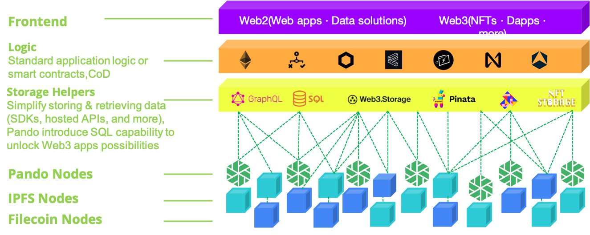

# Pando

[](https://codecov.io/gh/kenlabs/pando)


----

[Pando](https://en.wikipedia.org/wiki/Pando_(tree)) is, in fact, the scientific name of the largest organism on Earth. Above ground, Pando appears to be a grove of individual trees, like any other grove. But underground everything is connected by a single and vast root system. It is one tree. A [one-tree-forest](https://pandopopulus.com/pando-the-tree/). 

It’s the perfect metaphor of aggregating a huge forest of CID data around Filecoin and then over time…. Pando originally designed at Protocol Labs building [Reputation System (RepSys) ](https://www.notion.so/RepSys-Project-Plan-19d6813f2c724f4da5d233271426a6a0) that patrol the Filecoin network, assessing the Quality of Service of storage providers. 

>  With close to 4000 active storage providers (SPs) servicing the Filecoin network, it isn’t easy for clients to choose who to store data with. Different clients may value different properties, and priorities vary across data sets from the same client (e.g. price, latency, bandwidth, availability, etc.) Storage providers could congregate and advertise their Quality of Service (QoS) on a portal, but the public would have to trust them, which isn’t good.

The Web3-enabled Architectures with Pando as Filecoin L2 networks is unlocking lots of opportunities here and what I’m super excited for Fully FVM&EVM compatible Trustless Reputation System, Compuation over Pando, etc.



----

## To start using Pando

See our documentation on [pando.network](https://docs.pando.network/) and Try our interactive tutorial: [self-serve-integration](docs/self-serve-integration.md).

To use Pando integration code as a library in other applications, see the sdk components of [provider](sdk/pkg/provider) and [consumer](sdk/pkg/consumer).

Try the example of as [provider](example/provider) and [consumer](example/consumer).

Take a free course on [TODO]().

## To start developing Pando

The [Pando Porject repository](https://github.com/pando-project) hosts all information about building Pando from source, how to contribute code and documentation, who to contact about what, etc.

If you want to build Pando right away there are two options:

##### You have a working [Go environment].

```
mkdir -p $GOPATH/src/pando-project
cd $GOPATH/src/pando-project
git clone https://github.com/pando-project/pando.git
cd pando
make
```

##### You have a working [Docker environment].

```
git clone https://github.com/pando-project/pando.git
cd pando
make quick-release(TODO)
```

For the full story, head over to the [developer's documentation-TODO]().

## Support

If you need support, start with the [troubleshooting guide -TODO](), and work your way through the process that we've outlined.

That said, if you have questions, reach out to us on [slack](https://kenlabs.slack.com).

## Community Meetings 

The [Calendar-TODO]() has the list of all the meetings in Pando community in a single location.

## Adopters

The [User Case Studies-TODO](https://pando-network/case-studies/) website has real-world use cases of organizations across industries that are deploying/migrating to Pando.

## Governance

Pando project is governed by a framework of principles, values, policies and processes to help our community and constituents towards our shared goals.

The [Pando Community-TODO](https://github.com/pando-project/community/blob/master/governance.md) is the launching point for learning about how we organize ourselves.

The [Pando Steering community repo-TODO](https://github.com/pando/steering) is used by the Pando Steering Committee, which oversees governance of the Pando project.

## Roadmap 

The [TODO]() provides information about Pando releases, as well as feature tracking and backlogs.
